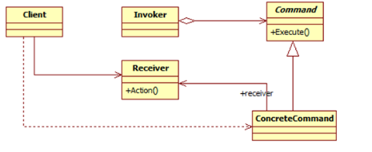

# 命令模式-----封装调用

### 命令设计模式简介
行为模式侧重于对象的响应性.它利用对象之间的交互实现更强大的功能.

命令模式也是一种行为设计模式,其中用于封装在完成一项操作时或在出发一个事件时所需的全部信息:
* 方法名称
* 拥有方法的对象
* 方法参数的值

### 了解命令设计模式
命令模式通常使用以下术语: Command,Receiver,Invoker和Client:
* Command对象了解Receiver对象的情况,并调用Receiver对象的方法;
* 调用者方法的参数值存储在Command对象中;
* 调用者知道如何执行命令;
* 客户端用来创建Command对象并设置其接收者.

命令模式的主要意图如下:
* 将请求封装为对象;
* 可用不同的请求对客户进行参数化;
* 允许将请求保存在队列中;
* 提供面向对象的回调.

命令模式可用于一下各种情景:
* 根据需要执行的操作对对象进行参数化;
* 将操作添加到队列并在不同地点执行请求;
* 创建一个结构来根据较小操作完成高级操作.

### 命令模式的UML类图

* Command: 声明执行操作的接口
* ConcreteCommand: 将一个Receiver对象和一个操作绑定在一起
* Client: 创建ConcreteCommand对象并设定其接收者
* Invoker: 要求该ConcreteCommand执行这个请求
* Receiver: 知道如何实施与执行一个请求相关的操作

整个流程图是非常简单的,客户端请求执行命令,调用者接受命令,封装它并将其放置到队列中.ConcreteCommand类根据所请求的命令来知道接收者执行特定的动作.

