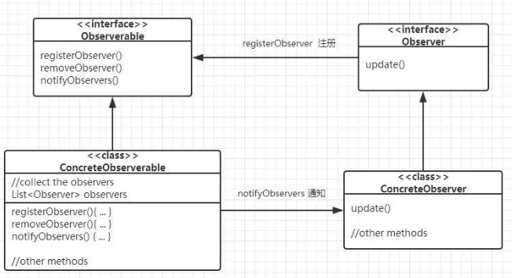

# 观察者模式-----了解对象的情况

### 行为型模式简介

* 创建型模式的工作原理是基于对象的创建机制的.由于这些模式隔离了对象的创建细节,所以使得代码能够与要创建的对象的类型相互独立.
* 结构型模式用于设计对象和类的结构,从而使它们可以相互协作已获得更大的结构.

##### 行为型模式
顾名思义,它主要关注的是对象的责任.它们用来处理对象之间的交互,以实现更大的功能.
行为型模式建议:对象之间应该能够彼此交互,同时还应该是松散耦合的.

### 理解观察者设计模式

在观察者模式中,**对象(Subject)维护了一个依赖[(Observer)列表]**,以便Subject可以使用Observer定义的任何方法通知所有观察者它所发生的变化.

观察者模式的主要目标如下:
* 它定义了对象之间的一对多的依赖关系,从而使得一个对象中的任何改动都将自动通知给其他依赖对象.
* 它封装了主题的核心组件.

观察者模式可用于一下多种场景
* 在分布式系统中实现事件服务;
* 用作新闻机构的框架;
* 股票市场也是观察者模式的一个大型场景;

### 观察者模式的UML类图

* Subject: 类Subject需要了解Observer.Subject类具有许多方法,诸如register()和deregister()等,Observer可以通过这些方法注册到Subject类中.因此,一个Subject可以处理多个Observer.
* Observer: 它为关注主题的对象定义了一个接口.它定义了Observer需要实现的各个方法,以便主题发生变化时能够获得相应的通知.
* ConcreteObserver: 它用来保存应该与Subject的状态保持一致的状态.它实现了Observer接口以保持其状态与主题中的变化一致.

### 观察者模式通知方式

有两种不同的方式可以通知观察者在主题中发生的变化.

##### 拉模式
在拉模式中,观察者扮演积极的角色

* 每当发生变化时,主题都会向所欲已注册的观察者进行广播.
* 出现变化时,观察者负责获取相应的变化情况,或者从订户哪里拉取数据.
* 拉模式的效率较低,因为它涉及两个步骤,第一步,主题通知观察者;第二部,观察者从主体那里提取所需的数据.

##### 推模式
在推模式中,主题是起主导作用的一方

* 与拉模式不同,变化由主题推送到观察者的.
* 在拉模式中,主题可以向观察者发送详细的信息(即使可能不需要).当主题发送大量观察者用不到的数据时,会使响应时间过长.
* 由于只从主题发送所需的数据,所以能够提高性能.

### 松耦合与观察者模式
松耦合是软件开发应该采用的重要设计原理之一.松耦合的主要目的是争取在批次交互的对象之间实现松散耦合设计.耦合是指**一个对象对于与其交互的对象的了解程度.
松耦合设计允许我们构建灵活的面向对象的系统,有效应对各种变化,因为它们降低了多个对象之间的依赖性.
松耦合架构具有一下特性:
* 它降低了一个元素内部发生的更该可能对其他元素产生意外影响的风险;
* 它使得测试,维护和故障排除工作更加简单;
* 系统可以轻松地分解为可定义的元素.

观察者模式提供了一种实现Subject和Observer松耦合的对象设计模式.一下几条可以更好得解释这一点.
* 主题对观察者为一个的了解就是它实现一个特定的接口.同时,它不需要了解具体的观察者.
* 可以随时添加任意新的观察者.
* 添加新的观察者时,根本不需要修改主题.
* 观察者或主题没有绑定在一起,所以可以彼此独立使用.如果需要的话,观察者可以在任何地方重复使用.
* 主题或观察者中的变化不会相互影响.

### 观察者模式缺点
* 观察者必须由具体观察者实现,这涉及继承.无法进行组合,因为观察者接口可以实例化;
* 如果实现不当,观察者可能会增加复杂性,并导致性能降低;
* 在软件应用程序中,通知有时可能是不可靠的,并导致竞争条件或不一致性.

