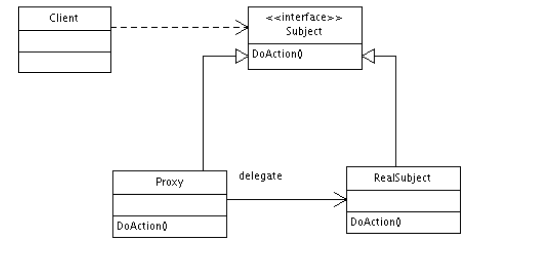

# 代理模式-----控制对象的访问

### 理解代理设计模式
* 代理通常就是一个介于寻求方和提供方之间的中介系统.寻求方是发出请求的一方,而提供方则是根据请求提供资源的一方.
* 在设计模式的上下文中,代理是**充当实际对象接口的类**.
* 代理就是封装实际服务对象的包装器或代理人．
* 代理可以为其包装的对象提供附加功能，而无需更改对象的代码．
* 代理模式的主要目的是为其他对象提供一个代理者或占位符，从而控制对实际对象的访问．

代理模式可以用于多种场景
- 它能够以更简单的方式表示一个复杂的系统.
- 它提高了现有的实际对象的安全性.
- 它为不同服务器上的远程对象提供本地接口.
- 它为消耗大量内存的对象提供了一个轻量级的句柄.

### UML

3个主要参与者
* 代理(Proxy): 它维护一个引用,允许代理(Proxy)通过这个引用来访问实际对象.它提供了一个与主题(Subject)相同的接口,以便代理可以替换真实的主题.代理还负责创建和删除真实主题(RealSubject)
* 主题(Subject): 它定义了RealSubject和Proxy的公共接口.以Proxy和RealSubject的形式实现主题(Subject),使用RealSubject的任何地方都可以使用代理(Proxy)
* 真实主题(RealSubject): 它定义了代理(Proxy)所代表的真实对象

从数据结构角度看,UML图可以表示如下.
* Proxy: 它是一个控制对RealSubject类访问的类.它处理客户端的请求,负责创建或删除RealSubject.
* Subject/RealSubject: 主题是定义真实主题(RealSubject)和代理(Proxy)相类似的接口.RealSubject是Subject接口的实际实现.它提供了真正的功能,然后由客户端使用.
* Client: 它访问要完成工作的Proxy类.Proxy类在内部控制对RealSubject的访问,并引导客户端(Client)所请求的工作

### 不同类型的代理

* 虚拟代理: 如果一个**对象实例化后会占用大量内存的话,可以先利用占位符来表示**,这就是所谓的虚拟代理.在虚拟代理中当客户端请求或访问对象时,才会创建实际对象.
* 远程代理: 它给位于远程服务器或不同地址空间上的实际对象**提供了一个本地表示**.如果我们需要见识服务器的CPU和磁盘利用率,就需要建立一个对象,该对象能够用于监视用程序运行的上下文中,同时还可以执行远程命令以获取实际的参数值.这种情况下,建立一个作为远程对象的本地表示的远程队里对象将可以帮助实现这个目标.
* 保护代理: 这种代理能够**控制RealSubject的敏感对象的访问**.代理有助于保护网站的核心功能,防止无法识别或未授权的代理访问它们.因此,代理对象会检查调用者是否具有转发请求所需的访问权限.
* 智能代理: 智能代理在访问对象时**插入其他操作**.

### 代理模式的优点

* 代理可以通过缓存笨重的对象或频繁访问的对象来提高应用程序的性能.
* 代理还提供对于真实主题的访问授权.
* 远程代理还便于与可用作网络连接和数据库连接的远程服务其进行交互,并可用于监视系统.

