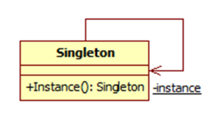

# 单例设计模式

### 理解单例设计模式
单例模式提供了这样一个机制,确保类有且只有一个特定类型的对象,并**提供全局访问点**.
* 确保类有且仅有一个对象被创建
* 为队形提供一个访问点,以使程序可以全局访问该对象
* 控制共享资源的并行访问
单例模式UML图



实现单例模式的一个简单方法是,是构造函数私有化,并创建一个静态方法来完成对象的初始化.这样,对象在第一次调用时创建,此后,这个类返回同一个对象.

利用Python实现经典的单例模式
1. 只允许Singleton类生成一个实例
2. 如果已经有一个实例了,我们会重复提供同一个对象
```python
# singleton1.py
class Singleton(object):
    def __new__(cls):
        if not hasattr(cls, 'instance'):
            cls.instance = super(Singleton, cls).__new__(cls)
        return cls.instance
s = Singleton()
print("Object created", s)
s1 = Singleton()
print("Object created1", s1)
```
在上面代码中,我们通过覆盖__new__方法(Python用于实例化对象的特殊方法)来控制对象的创建.对象s就是由__new__方法但在创建之前,该方法会检查对象是否已存在.
方法hasattr(Python特殊方法,用来了解对象是否具有某个属性)用于查看对象cls是否具有属性instance,该属性的作用是检查cls是否具有属性instance,该属性的作用是检查gailei是否已经生成了一个对象.当对象是
被请求的时候,hasattr()发现对象已经存在,所以,对象是被分配已有的对象实例.

### 单例设计模式中的懒汉式实例化
单例模式的用例之一就是懒汉式实例化.例如,在导入模块的时候,我们可能会无意中创建一个对象,但当时根本用不到它.懒汉模式实例化能够确保在实际需要时才创建对象.所以,懒汉式实例化是一种节约资源并仅在需要时才创建它们的方式.
```python
class Singleton:
    __instance = None
    def __init__(self):
        if not Singleton.__instance:
            print("__init__method called..")
        else:
            print("Instance already created:", self.get_instance())
    
    @classmethod
    def get_instance(cls):
        if not cls.__instance:
            cls.__instance = Singleton()
        return cls.__instance

s = Singleton()
print("Object created", Singleton.get_instance())
s1 = Singleton()
'''
output:
__init__method called..
__init__method called..
Object created <__main__.Singleton object at 0x7fc6b7718550>
Instance already created: <__main__.Singleton object at 0x7fc6b7718550>
'''
```
执行s = Singleton()时,它会调用__init__方法,但是没有新的对象被创建.然而,实际的对象创建发生在调用Singleton.get_instance()的时候,我们正式通过这种方式来实现懒汉式实例化的.