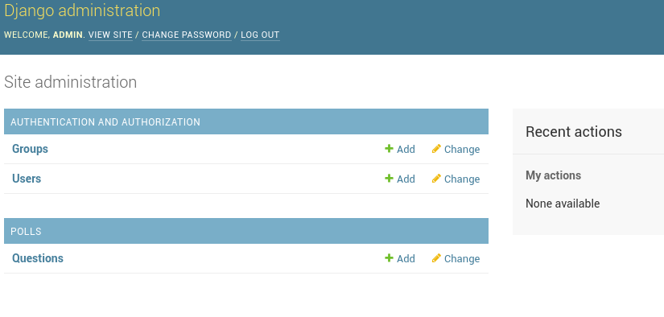

此文档内容来自于https://docs.djangoproject.com
## part 1
```bash
➜  Django git:(master) ✗ django-admin startproject mysite
➜  mysite git:(master) ✗ tree 
.
├── manage.py
└── mysite
    ├── __init__.py     一个空文件告诉python这个目录应该被认为是一个Python包
    ├── settings.py     Django项目配置文件
    ├── urls.py         Django项目URL声明
    └── wsgi.py         作为项目运行在WSGI兼容的Web服务器上的入口
 ➜  mysite git:(master) ✗ python manage.py runserver
```

### 创建投票应用
##### 项目VS应用
应用是一个专门做某件事的网络应用程序——比如博客系统，或者公共记录的数据库，或者简单的投票程序。
项目则是一个网站使用的配置和应用的集合。项目可以包含很多个应用。应用可以被很多个项目使用。
```bash
➜  mysite git:(master) ✗ python manage.py startapp polls
➜  polls git:(master) ✗ tree
.
├── admin.py
├── apps.py
├── __init__.py
├── migrations
│   └── __init__.py
├── models.py
├── tests.py
└── views.py

1 directory, 7 files
```
##### 编写第一个视图
* polls/views.py
* 为了创建URLconfs,在polls目录里创建一个urls.py
```python
from django.urls import path

from . import views

urlpatterns = [
    path('', views.index, name='index'),
]
```
* 下一步是要在根URLconf文件中指定创建的polls.urls模块,在mysite/urls.py文件的urlpatterns列表里插入一个include(),如下
```python
from django.contrib import admin
from django.urls import include, path

urlpatterns = [
    path(route='polls/', view=include('polls.urls')),
    path('admin/', admin.site.urls),
]
```
函数include()允许引用其他URLconfs.

##### path()
path()具有四个参数,两个必选参数:route和view,两个可选参数kwargs和name
* route:
route是一个匹配URL的准则(类似正则表达式).当Django响应一个请求时它会从urlpatterns的
第一项开始,按顺序依次匹配列表中的项,直到找到匹配的项
* view:
当Django找到了匹配的准则,就会调用这个特定的视图参数,并传入一个HTTPRequest对象作为第一个参数,
被"捕获"的参数以关键字的形式传入
* kwargs:
任意个关键字参数可以作为一个字典传递给目标视图函数
* name:
为URL取名使得在Django的任意地方唯一地引用它,尤其是在模板中

## part 2
#### 数据库配置
打开mysite/settings.py.这是包含了Django项目设置的Python模块
通常这个配置文件使用SQLite作为默认浏览器.
* ENGINE -- 可选值有 'django.db.backends.sqlite3'， 'django.db.backends.postgresql'，'django.db.backends.mysql'， 'django.db.backends.oracle'。
* NAME - 数据库的名称。
* 如果使用的是 SQLite，数据库将是你电脑上的一个文件，在这种情况下， NAME 应该是此文件的绝对路径，包括文件名。**默认值 os.path.join(BASE_DIR, 'db.sqlite3') 将会把数据库文件储存在项目的根目录**
通常， INSTALLED_APPS 默认包括了以下 Django 的自带应用：

* django.contrib.admin -- 管理员站点， 你很快就会使用它
* django.contrib.auth -- 认证授权系统。
* django.contrib.contenttypes -- 内容类型框架。
* django.contrib.sessions -- 会话框架。
* django.contrib.messages -- 消息框架。
* django.contrib.staticfiles -- 管理静态文件的框架.

```bash
➜  myweb git:(master) ✗ python manage.py migrate
```
这个migrate命令检查INSTALLED_APPS设置,为其中的每个应用穿件需要的数据表.

#### 创建模型
在Django里写一个数据库驱动的Web应用第一步是定义模型-也就是数据库结构设计和附加的其他元数据.
```python
from django.db import models

# Create your models here.
class Question(models.Model):
    question_text = models.CharField(max_length=200)
    pub_date = models.DateTimeField('data published')

class Choice(models.Model):
    question = models.ForeignKey(Question, on_delete=models.CASCADE)
    choice_text = models.CharField(max_length=200)
    votes = models.IntegerField(default=0)
```
#### 激活模型
* 为这个应用创建schema(生成CREATE TEABLE语句).
* 创建可以与Question和Choice对象进行交互的Python数据库API
但是首先得把polls应用安装到项目里面
为了在我们的工程中包含这个应用,我们需要配置类INSTALL_APPS中添加设置.
因为PollsConfig类写在polls/apps.py中,所以它的点式路径是'polls.apps.PollsConfig'.
在文件mysite/settings.py中INSTALL_APPS添加点式路径.
```bash
➜  myweb git:(master) ✗ python manage.py makemigrations polls
Migrations for 'polls':
  polls/migrations/0001_initial.py:
    - Create model Choice
    - Create model Question
    - Add field question to choice
```
通过makemigrations命令,Django会检测你对模型文件的修改,并且把修改的部分存储为一次迁移
**迁移(migration)**是Django对于模型定义(也就是数据库结构)的变化的存储形式,也只是磁盘上的文件
Django有一个自动执行数据库迁移并同步管理数据库机构的命令
```bash
➜  myweb git:(master) ✗ python manage.py sqlmigrate polls 0001
BEGIN;
--
-- Create model Choice
--CREATE TABLE "polls_choice" ("id" integer NOT NULL PRIMARY KEY AUTOINCREMENT, "choice_text" varchar(200) NOT
 NULL, "votes" integer NOT NULL);
--
-- Create model Question
--
CREATE TABLE "polls_question" ("id" integer NOT NULL PRIMARY KEY AUTOINCREMENT, "question_text" varchar(200) NOT NULL, "pub_date" datetime NOT NULL);
--
-- Add field question to choice
--
ALTER TABLE "polls_choice" RENAME TO "polls_choice__old";
CREATE TABLE "polls_choice" ("id" integer NOT NULL PRIMARY KEY AUTOINCREMENT, "choice_text" varchar(200) NOT NULL, "votes" integer NOT NULL, "question_id" integer NOT NULL REFERENCES "polls_question" ("id") DEFERRABLE INITIALLY DEFERRED);
INSERT INTO "polls_choice" ("id", "choice_text", "votes", "question_id") SELECT "id", "choice_text", "votes", NULL FROM "polls_choice__old";
DROP TABLE "polls_choice__old";
CREATE INDEX "polls_choice_question_id_c5b4b260" ON "polls_choice" ("question_id");
COMMIT;
```
请注意一下几点:
* 输出内容和谁用的数据库有关,上面的输出示例用的是PostgreSQL
* 数据库的表名是由应用名(polls)和模型名的小写形式(question和choice)连接而来.
* 主键(IDs)会被自动创建(也可以自己定义).
* 默认的,Django会在外键字段名后追加字符串"_id".
* 外键关系由FOREIGN KEY生成.不用关心DEFERRABLE部分,它只告诉PostgreSql,请在事务全都执行完后在创建外键关系
* 生成的SQL语句是为你所用的数据库定制的,所以哪些和数据库有关的字段类型,比如auto_increment(MySQL),serial(PostgreSQL)和integer primary key autoincrement(SQLite),Django会帮你自动处理.哪些和引号相关的事情-例如,是使用单引号还是双引号,一样会被自动处理
* 这个sqlmigrate命令并没有真正在你的数据库中执行迁移,它只是把命令输出到屏幕上,让你看看Django认为需要执行哪些SQL语句.这在你想看看Django到底准备做什么,或者当你是数据库管理员,需要写脚本来批量处理数据库时会很有用.

python manage.py check ;这个命令帮助你检查项目中的问题，并且在检查过程中不会对数据库进行任何操作。

现在再次运行migrate命令,在数据库里创建新定义的模型的数据表
```bash
➜  myweb git:(master) ✗ python manage.py migrate
Operations to perform:
  Apply all migrations: admin, auth, contenttypes, polls, sessions
Running migrations:
  Applying contenttypes.0001_initial... OK
  Applying auth.0001_initial... OK
  Applying admin.0001_initial... OK
  Applying admin.0002_logentry_remove_auto_add... OK
  Applying admin.0003_logentry_add_action_flag_choices... OK
  Applying contenttypes.0002_remove_content_type_name... OK
  Applying auth.0002_alter_permission_name_max_length... OK
  Applying auth.0003_alter_user_email_max_length... OK
  Applying auth.0004_alter_user_username_opts... OK
  Applying auth.0005_alter_user_last_login_null... OK
  Applying auth.0006_require_contenttypes_0002... OK
  Applying auth.0007_alter_validators_add_error_messages... OK
  Applying auth.0008_alter_user_username_max_length... OK
  Applying auth.0009_alter_user_last_name_max_length... OK
  Applying polls.0001_initial... OK
  Applying sessions.0001_initial... OK
```
这个migrate命令选中所有还没有执行过的迁移(Django通过在数据库中创建一个特殊的表django_migrations来跟踪执行过哪些迁移)并应用在数据库上-也就是将对象模型的更改同步到数据库结构上

迁移是非常强大的功能,它能让你在开发过程中持续的改变数据库结构而不需要重新删除和创建表-它专注于数据库平滑升级而不会丢失数据.
改变模型需要三步:
* 编辑models.py文件,改变模型
* 运行python manage.py makemigrations为模型的改变生成迁移文件.
* 运行python manage.py migrate来应用数据库迁移

数据库迁移被分解生成和应用两个命令是为了让你能够在代码控制系统上提交迁移数据并使其能在多个应用里使用.

#### 初试API
进入交互python命令行,尝试一下Django创建的各种API.
使用这个命令而不简单使用"python"是因为manage.py会设置DJANGO_SETTINGS_MODULE环境变量,这个变量会让Django根据mysite/settings.py文件来设置Python包的导入路径.
```bash
➜  myweb git:(master) ✗ python manage.py shell
Python 3.6.5 |Anaconda, Inc.| (default, Apr 29 2018, 16:14:56)
Type 'copyright', 'credits' or 'license' for more information
IPython 6.4.0 -- An enhanced Interactive Python. Type '?' for help.

In [1]: from polls.models import Choice, Question
# No questions are in the system yet.
In [2]: Question.objects.all() 
Out[2]: <QuerySet []>
# Create a new Question.
# Support for time zones is enabled in the default settins file, so
# Django expects a datetime with tzinfo for pub_data.Use timezone.Now()
# instead of datetime.datatime.now() and it will do the right thing.
In [3]: from django.utils import timezone
In [6]: q = Question(question_text="What's new?", pub_date=timezone.now())
# Save the object into the database.You have to call save() explicitly.
In [7]: q.save()
# Now it has an ID.
In [ ]: q.id
Out[ ]: 1
# Access model field values via Python attributes.
In [8]: q.question_text
Out[8]: "What's new?"
In [9]: q.pub_date
Out[9]: datetime.datetime(2019, 1, 10, 9, 47, 43, 192475, tzinfo=<UTC>)
# objects.all() displays all the questions in the database.
In [10]: Question.objects.all()
Out[10]: <QuerySet [<Question: Question object (1)>]>
```
<Question: Question object (1)>对于我们了解这个对象的细节没有什么帮助.让我们通过编辑Question模型的代码(位于polls/models.py中)来修复这个问题.给Question和Choice增加__str__()方法.

```python
class Question(models.Model):
    # ...
    def __str__(self):
        return self.question_text

class Choice(models.Model):
    # ...
    def __str__(self):
        return self.choice_text
```
新加入的import datetime和from django.utils import timezone分贝导入了Python的标准datetime模块和Django中和时区相关的django.utils.timezone工具模块.保存文件然后通过python manage.py shell命令再次打开Python交互式命令行
```bash
>>> from polls.models import Choice, Question

# Make sure our __str__() addition worked.
>>> Question.objects.all()
<QuerySet [<Question: What's up?>]>

# Django provides a rich database lookup API that's entirely driven by
# keyword arguments.
>>> Question.objects.filter(id=1)
<QuerySet [<Question: What's up?>]>
>>> Question.objects.filter(question_text__startswith='What')
<QuerySet [<Question: What's up?>]>

# Get the question that was published this year.
>>> from django.utils import timezone
>>> current_year = timezone.now().year
>>> Question.objects.get(pub_date__year=current_year)
<Question: What's up?>

# Request an ID that doesn't exist, this will raise an exception.
>>> Question.objects.get(id=2)
Traceback (most recent call last):
    ...
DoesNotExist: Question matching query does not exist.

# Lookup by a primary key is the most common case, so Django provides a
# shortcut for primary-key exact lookups.
# The following is identical to Question.objects.get(id=1).
>>> Question.objects.get(pk=1)
<Question: What's up?>

# Make sure our custom method worked.
>>> q = Question.objects.get(pk=1)
>>> q.was_published_recently()
True

# Give the Question a couple of Choices. The create call constructs a new
# Choice object, does the INSERT statement, adds the choice to the set
# of available choices and returns the new Choice object. Django creates
# a set to hold the "other side" of a ForeignKey relation
# (e.g. a question's choice) which can be accessed via the API.
>>> q = Question.objects.get(pk=1)

# Display any choices from the related object set -- none so far.
>>> q.choice_set.all()
<QuerySet []>

# Create three choices.
>>> q.choice_set.create(choice_text='Not much', votes=0)
<Choice: Not much>
>>> q.choice_set.create(choice_text='The sky', votes=0)
<Choice: The sky>
>>> c = q.choice_set.create(choice_text='Just hacking again', votes=0)

# Choice objects have API access to their related Question objects.
>>> c.question
<Question: What's up?>

# And vice versa: Question objects get access to Choice objects.
>>> q.choice_set.all()
<QuerySet [<Choice: Not much>, <Choice: The sky>, <Choice: Just hacking again>]>
>>> q.choice_set.count()
3

# The API automatically follows relationships as far as you need.
# Use double underscores to separate relationships.
# This works as many levels deep as you want; there's no limit.
# Find all Choices for any question whose pub_date is in this year
# (reusing the 'current_year' variable we created above).
>>> Choice.objects.filter(question__pub_date__year=current_year)
<QuerySet [<Choice: Not much>, <Choice: The sky>, <Choice: Just hacking again>]>

# Let's delete one of the choices. Use delete() for that.
>>> c = q.choice_set.filter(choice_text__startswith='Just hacking')
>>> c.delete()
```
#### 介绍管理页面
Django全自动地根据模型创建后台界面.

###### 创建一个管理员账号
```bash
➜  myweb git:(master) ✗ python manage.py createsuperuser 
Username (leave blank to use 'example'): admin
Email address: name@outlook.com
Password: 
Password (again): 
Superuser created successfully.
```
###### 启动开发服务器
Django的管理界面默认就是启动的,如果开发服务器未启动,用以下命令启动它.
```bash
➜  myweb git:(master) ✗ python manage.py runserver
```
###### 进入管理站点页面
登陆后,你将会看到集中可编辑的内容: 用户和组.它们是由django.contrib.auth提供的,这是Django开发的认证框架
###### 向管理页面中加入投票应用
投票应用并没有在索引页面里显示
只需要做一件事: 告诉管理页面,问题Question对象需要被管理.打开polls/admin.py文件
```python
from django.contrib import admin
from .models import Question
# Register your models here.
admin.site.register(Question)
```
重新加载后

###### 体验便捷的管理功能
现在我们向管理页面注册了问题Question类.Django知道它应该被显示在索引页里:
注意事项:
* 这个表单是从问题Question模型中自动生成的
* 不同的字段类型(日期时间段DateTimeField,字符字段CharField)会生成对应的HTML输入控件.每个类型字段都知道它们该如何在管理页面显示自己
* 每个日期时间段DateTimeField都有JavaScript写的快捷按钮.日期有转到今天(Today)的快捷键和一个弹出式日历界面.时间有设为现在(Now)的快捷键和一个列出常用时间的方便的弹出式列表
页面底部提供了几个选项:
* 保存(Save) -保存改变,然后返回对象列表
* 保存并继续编辑（Save and continue editing） - 保存改变，然后重新载入当前对象的修改界面。
* 保存并新增（Save and add another） - 保存改变，然后添加一个新的空对象并载入修改界面。
* 删除（Delete） - 显示一个确认删除页面。

## part3
Django中的视图的概念是[**一类具有相同功能和模板的网页的集合**]
在Django中网页和其他内容都是从视图派生而来.每一个视图表现为一个简单的Python函数(或者说方法,如果是在基于类的视图里的话).Django会根据用户请求的URL来选择使用哪个视图.(更准确的说,是根据URL中域名之后的部分).
一个URL模型定义了某种URL的基本格式:
/newsarchive/<year>/<month>/.
为了将URL和视图关联起来,Django使用了'URLconfs'来配置.
URLconf将URL模式映射到视图.

#####　编写跟多的视图
```python
# polls/views.py
def detail(request, question_id):
    return HttpResponse("You're looking at question %s." % question_id)

def results(request, question_id):
    response = "You're looking at results of question %s."
    return HttpResponse(response % question_id)

def vote(request, question_id):
    return HttpResponse("You're voting on question %s." % question_id)

```
把这些新视图添加进polls.urls模块里,只需添加几个url()函数调用就行
```python
# polls/urls.py
from django.urls import path

from . import views

urlpatterns = [
    # ex: /polls/
    path('', views.index, name='index'),
    # ex: /polls/5/
    path('<int:question_id>/', views.detail, name='detail'),
    # ex: /polls/5/results/
    path('<int:question_id>/results/', views.results, name='results'),
    # ex: /polls/5/vote/
    path('<int:question_id>/vote/', views.vote, name='vote'),
]
```
当请求"/polls/34/"时,Django会载入mysite.urls模块,因为这在配置ROOT_URLCONF中设置了.
然后Django寻找名为urlpatterns变量并且按序匹配正则表达式.再找到'polls/',它切掉了匹配的
文本("polls/"), 将剩余文本--"34/"",发送至'polls.urls'URLconf作进一步处理.这里剩余
文本匹配了'<int:question_id>/',使得Django调用detail():
```python
detail(request=<HttpRequest object>, question_id=34)
```
question_id=34由<int:question_id>匹配生成.使用尖括号"捕获这部分URL,且以关键字参数的
形式发送给视图函数.上述字符串:question_id>部分重新定义了将被用于匹配模式的变量名
而int:则是一个转换器决定了应该以什么变量类型匹配这部分的URL路径.

##### 一个真正有用的视图
每个视图必须要做的只有两件事: **返回一个包含被请求页面内容的HttpResponse对象,或者抛出一个异常**
Django只要求返回的是一个HttpResponse,或者抛出一个异常
在index()函数里插入一些新的内容,让它能展示数据库里以发布日期排序的5个投票问题,以空格分割:
```python
# polls/views.py
def index(request):
    latest_question_list = Question.object.order_by('-pub_date')[:5]
    output = ', '.join([q.question_text for q in latest_question_list])
    return HttpResponse(output)
```
项目的 TEMPLATES 配置项描述了 Django 如何载入和渲染模板。默认的设置文件设置了 DjangoTemplates 后端，并将 APP_DIRS 设置成了 True。这一选项将会让 DjangoTemplates 在每个 INSTALLED_APPS 文件夹中寻找 "templates" 子目录。这就是为什么尽管我们没有像在第二部分中那样修改 DIRS 设置，Django 也能正确找到 polls 的模板位置的原因。
###### 模板命名空间
虽然现在可以将模板文件直接放在polls/templates文件夹中(而不是再创建一个匹配的模板文件)如果有一个模板文件正好和另一个应用中的某个模板文件重名,Django没有办法区分它们.我们需要帮助Django选择正确的模板,最简单的方法就是把它们放入各自的命名空间,也就是把这些模板放入一个和自身应用重名的子文件夹里.

将下面的代码输入到刚刚创建的模板文件中
```html
<!-- polls/templates/polls/index.html -->

    <ul>
    \
        <li><a href="/polls/{{ question.id }}/"> {{ question.question_text }} </a></li>
    
    </ul>

    <p> No polls are available. </p>

```
然后更新一下polls/views.py里的index视图来使用模板.
```python
def index(request):
    latest_question_list = Question.objects.order_by('-pub_date')[:5]
    templates = loader.get_template('polls/index.html')
    contect = {
        'latest_question_list': latest_question_list,
    }
    return HttpResponse(templates.render(contect, request))
```
上述代码的作用是,载入polls/index.html模板文件,并且向它传递一个上下文(context).这个上下文是一个字典,它将模板内的变量映射为Python对象.

##### 一个快捷函数： render()
**载入模板,填充上下文,再返回它生成的HttResponse对象**是一个非常有用的操作流程.于是Django提供了一个快捷函数,我们用它来重写index()视图:
```python
# polls/views.py
def index(request):
    latest_question_list = Question.objects.order_by('-pub_date')[:5]
    templates = loader.get_template('polls/index.html')
    context = {
        'latest_question_list': latest_question_list,
    }
    return render(request, 'polls/index.html', context)
```
注意到我们不需要导入loader和HttpResponse.不过如果你还要其他函数(比如说detail,result,和vote)需要用到它的话,就需要保持HttpResponse的导入.

##### 抛出404错误
现在来处理投票详情视图--它会显示指定投票的问题标题.下面是这个视图的代码:
```python
# polls/views.py
def detail(request, question_id):
    try:
        question = Question.objects.get(pk=question_id)
    except Question.DoesNotExist:
        raise Http404("Question does not exist")
    return render(request, 'polls/detail.html', {'question': question})
```
这里有个新原则.如果**指定问题ID所对应的问题不存在**,这个视图就会抛出一个Http404异常.

##### get_object_or_404()
尝试用get()函数获取一个对象,如果不存在就抛出Http404错误也是一个普遍的流程.Django也提供了一个快捷函数,下面是修改后的详情detail()视图代码.
```python
def detail(request, question_id):
    question = get_object_or_404(Question, pk=question_id)
    return render(request, 'polls/detail.html', {'question': question})
```
get_object_or_404（）函数将Django模型作为其第一个参数和任意数量的关键字参数，并将其传递给模型管理器的get（）函数。如果对象不存在，它会引发Http404。

##### 使用模板系统
```html
<h1>{{ question.question_text }}</h1>
<ul>

    <li>{{ choice.choice_text }}</li>

</ul>
```
模板系统同意使用点符号访问变量的属性.示例{{ question.question_text }}中,首先Django尝试对question对象使用字典查找(也就是obj.get(str)操作),如果失败了就尝试属性查找(也就是obj.str操作),
结果是成功了.如果这一操作也失败的话,将会尝试列表查找(也就是obj[int]操作).
在循环中发生的函数调用: question.choice_set.all被解释为Python代码
question.choice_set.all(),将会返回一个可迭代的Choice对象,,这一对象可以再标签内部使用.

##### 去除模板中的硬编码URL
在polls/index.html里编写投票链接时,链接是硬编码的:
```html
<li><a href="/polls/{{ question.id }}/">{{ question.question_text }}</a></li>
```
问题在于,硬编码和强耦合的链接,对于一个包含很多应用的项目来说,修改起来是十分困难的.然而,因为在polls.urls的url()函数中通过name参数为URL定义了名字,可以用标签来替代它:
```html
<li><a href="">{{ question.question_text }}</a></li>
```

##### 为URL名称添加命名空间.
项目只有一个应用，polls.在一个真实的Django项目中,可能会有更多应用.Django通过在根URLconf中添加命名空间来分辨重名的URL.在 polls/urls.py 文件中稍作修改，加上 app_name 设置命名空间：
```python
app_name = 'polls'
```
在polls/index.html文件href=部分修改成:
```html
        <li><a href="">{{ question.question_text }}</a></li>
        <li><a href="">results</a></li>
        <li><a href="">vote</a></li>
```
## part 4
### 编写一个简单的表单
跟新polls/detail.html,让它包含一个HTML<form>元素
```html
<h1>{{ question.question_text }}</h1>
<p><strong>{{ error_message }}</strong></p>

<form action="" method="post">


    <input type="radio" name="choice" id="chice{{ forloop.counter }}" 
    value="{{ choice.id }}">
    <label for="choice{{ forloop.counter }}">{{ choice.choice_text }}</label><br>

<input type="submit" value="Vote">
</form>
```
* 上面的模板在Question的每个Choice前添加一个单选按钮.每个按钮的value属性是对应的各个Choice的ID.每个单选按钮的name是"choice".这意味着,当有人选择一个单选按钮并提交表单时,它将发送一个POST数据choice=#,其中#为选择的Choice的ID.这是HTML表单的基本概念.
* 我们设置表单的action为,并设method="post"``.使用method="post"(与其相对的是``method="get"``)是非常重要的,因为这个提交表单的行为会改变服务器端的数据.无论何时,当你需要创建一个改变服务器数据的表单时,请使用``method="post".这不是Django的特定技巧;这是优秀的网站开发技巧.
* forloop.counter指示for标签已经循环多少次
* 由于创建一个POST表单(它具有修改数据的作用),所以我们要小心跨站点请求伪造.Django已经拥有一个用来防御它的非常容易使用的系统.简而言之,素有针对内部URL的POST表单都应该使用模板标签.

创建一个Django视图来处理提交的数据.
```python
def vote(request, question_id):
    question = get_object_or_404(Question, pk=question_id)
    try:
        selected_choice = question.choice_set.get(pk=request.POST['choice'])
    except(KeyError, Choice.DoesNotExist):
        # Redisplay the question voting from
        return render(request, 'polls/detail.html', {
            'question': question,
            'error_message': "You didn't select a choice.",
        })
    else:
        selected_choice.votes += 1
        selected_choice.save()
        # Always return an HttpResponseRedirect after successfully dealing
        # with POST data.This prevents data from being posted twice if user hits the Back button.
        return HttpResponseRedirect(reverse('polls:results', args=(question_id,)))
```
* request.POST是一个类字典对象,让你可以通过关键字的名字获取提取的数据.这个例子中,
  request.POST['choice']以字符串形式返回选择的Choice的ID.request.POST的值永远是字符串.
* 注意,Django还以同样的方式提供request.GET用于访问GET数据--但我们在代码中显示地使用request.POST,以保证数据智能通过POST调用改动.
* 如果request.POST['choice']数据中没有提供choice,POST将引发一个KeyError.上面的代码检查KeyError,如果没有给出choice将重新显示Question表单和一个错误信息.
* 在增加Choice的得票数之后,代码返回一个HttpResponseRedirect而不是常用的HttpResponse,HttpResponseRedirect只接收一个参数:用户将要被重定向的URL(请继续看下去,将会解释如何构造这个例子中的URL)
* 正如上面的Python注释指出的那样，在成功处理POST数据之后，应该总是返回一个HttpResponseRedirect.这个提示不是Django特有的;这只是一个很好的Web开发实践.
* 在这个例子中,我们在HttpResponseRedirect的构造函数中使用reverse()函数.这个函数避免了我们在视图函数中硬编码URL.它需要我们给出我们**想要跳转的视图的名字**和**该视图所对应的URL模式中需要给该视图提供的参数**.reverse()调用返回一个这样的字符串:
  '/polls/3/results/'
  其中3是question.id的值.重定向的URL将调用'results'视图来显示最终的页面.,正如part 3提到的,HttpResponse是一个HttpRequest对象.当有人对Question进行投票后,vote()视图将请求重定向到Question的结果界面.
  ```python
  # polls/views.py
  def results(request, question_id):
    question = get_object_or_404(Question, pk=question_id)
    return render(request, 'polls/results.html', {'question': question})
  ```
  这和part 3中的detail()视图几乎一模一样.唯一不同的是模板的名字,我们将在稍后解决这个冗余的问题,现在创建一个polls/results.html模板:
  ```html
  <h1>{{ question.question_text }}</h1>

<ul>

    <li>{{ choice.choice_text }} -- {{ choice.votes}} vote{{ choice.votes|pluralize }}</li>

</ul>

<a href="">Vote again? </a>
```
我们的 vote() 视图代码有一个小问题。代码首先从数据库中获取了 selected_choice 对象，接着计算 vote 的新值，最后把值存回数据库。如果网站有两个方可同时投票在 同一时间 ，可能会导致问题。同样的值，42，会被 votes 返回。然后，对于两个用户，新值43计算完毕，并被保存，但是期望值是44。这个问题被称为竞争条件.

### 使用通用视图
detail()(在part 3中)和reuslts()视图都很简单--并且,像上面提到的那样,存在冗余问题,用来显示一个投票列表的index()视图和它们类似.
这些视图反映基本的Web开发中一个常见的情况:根据URL中的参数从数据库中获取数据,载入模板文件然后返回渲染后的模板.由于这种情况特别常见,Django提供一种快捷方式,叫做"通用视图"系统.
通用视图将常见的模式抽象化,可以使你在编写应用时甚至不需要编写Python代码.
让我们将我们的投票应用转换程使用通用视图系统,这样我们可以删除许多我们的代码.我们仅仅需要做一下几步来完成转换:
1. 转换URLconf
2. 删除一些旧的,不需要的视图
3. 基于Django的通用视图引入新的视图

###### 为什么要重构代码?
一般来说,当编写一个Django应用时,你应该先评估一下通用视图是否可以解决你的问题,你应该在一开始使用它,而不是进行到一半时重构代码.本教程目前为止是有意将重点放在"艰难的地方"编写视图,这是为将重点放在核心概念上.

##### 改良URLconf
首先打开,polls/urls.py并修改成
```python
urlpatterns = [
    # path('', views.index, name='index'),
    path('', views.IndexView.as_view(), name='index'),
    path('<int:pk>/', views.DetailView.as_view(), name='detail'),
    path('<int:pk>/results/', views.ResultsView.as_view(), name='results'),
    path('<int:question_id>/vote/', views.vote, name='vote')
]
```
第二个和第三个匹配准则中,路径字符串匹配模式的名称已经由<question_id>改为<pk>

##### 改良视图
下一步,我们将删除旧的index, detail, 和results视图,并用Django的通用视图代替.
```python
# polls/views.py
class IndexView(generic.ListView):
    template_name = 'polls/index.html'
    context_object_name = 'latest_question_list'
    # 对于 ListView，自动生成的 context 变量是 question_list。
    # 为了覆盖这个行为，我们提供 context_object_name 属性，表示我们想使用latest_question_list。

    def get_queryset(self):
        # Return the last five published questions
        return Question.objects.order_by('pub_date')[:5]

class DetailView(generic.DetailView):
    model = Question
    template_name = 'polls/detail.html'

class ResultsView(generic.DetailView):
    model = Question
    template_name = 'polls/results.html'
```
我们这里使用两个通用视图: ListView和DetailView.这两个视图分别抽象"显示一个对象列表"和"显示一个特定类型对象的详细信息页面"这两种概念.
* 每个通用视图需要知道它将作用于哪个模型.这由model属性提供
* DetailView期望从URL中捕获名为"pk"的主键值,随意我们为通用视图把question_id改成pk

默认情况下,通用视图DetailView使用一个叫做<app name>/<model name>_detail.html的模板.在我们的例子中,它将使用"polls/question_detail.html"模板.template_name属性是来告诉Django使用一个指定的模板名字,而不是自动生成默认名字.我们也为results列表视图指定了template_name--这确保results视图和detail视图在渲染时具有不同的外观,即使他们后台都是同一个DetailView.

类似地,ListView使用一个叫做<app name>/<model name>_list.html的默认模板,我们使用template_name来告诉ListView使用我们创建的已经存在的"polls/index.html"模板.

在之前的部分中,提供模板文件时都带有一个包含question和latest_question_list变量的context.对于DetailView,question变量会自动提供--因为我们使用Django的模型(Question),Django能够为context变量决定一个合适的名字.然而对于ListView,自动生成的变量是question_list.为了覆盖这个行为,我们提供context_object_list.作为一种替换方案,你可以改变你的模板来匹配新的context变量--这是一种更便捷的方法,告诉Django使用你想使用的变量名.

## Part 5
